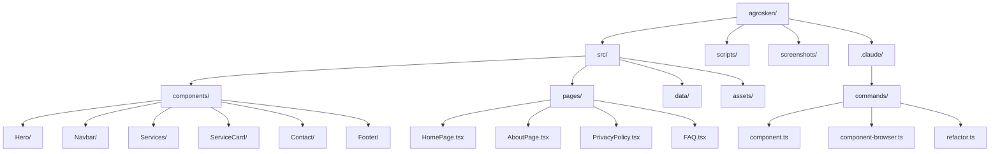
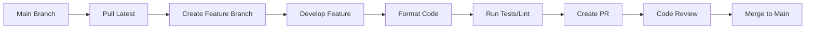

# Agrosken

Modern agricultural technology platform providing smart farming solutions through IoT sensors, AI-powered analytics, and data-driven insights.

## 🚀 Quick Start

```bash
# Install dependencies
npm install

# Start development server
npm run dev

# Build for production
npm run build
```

## 📋 Table of Contents

- [Features](#features)
- [Tech Stack](#tech-stack)
- [Project Structure](#project-structure)
- [Development](#development)
- [Claude Slash Commands](#claude-slash-commands)
- [Deployment](#deployment)
- [Contributing](#contributing)

## ✨ Features

- **Smart Crop Monitoring**: Real-time crop monitoring with IoT sensors
- **Precision Agriculture**: AI-powered analytics for optimized farming
- **Weather Integration**: Advanced weather forecasting and alerts
- **Resource Management**: Track and optimize water, fertilizer usage
- **Data Analytics**: Comprehensive farm performance dashboards
- **Mobile Responsive**: Full functionality across all devices

## 🛠 Tech Stack

- **Frontend**: React 19.1.0 + TypeScript
- **Build Tool**: Vite
- **Styling**: Tailwind CSS v4
- **Animations**: Framer Motion
- **Routing**: React Router v7
- **Icons**: Heroicons
- **Development**: ESLint, Prettier, Puppeteer (screenshots)

## 📁 Project Structure



## 💻 Development

### Prerequisites

- Node.js 18+
- npm or yarn
- Git

### Installation

```bash
# Clone repository
git clone https://github.com/pantheraworks/agrosken.git
cd agrosken

# Install dependencies
npm install

# Start development server
npm run dev
```

### Available Scripts

| Command | Description |
|---------|------------|
| `npm run dev` | Start development server at http://localhost:5173 |
| `npm run build` | Type check and build for production |
| `npm run preview` | Preview production build locally |
| `npm run lint` | Run ESLint |
| `npm run format` | Format code with Prettier |
| `npm run screenshot` | Capture screenshots of all pages |
| `npm run deploy` | Deploy to production (requires .env setup) |

### Development Workflow



## 🤖 Claude Slash Commands

This project includes custom slash commands for Claude Code to streamline development:

### `/component` - Component Creation
Creates new components from reference images with automated workflow:
- Switches to main branch and creates feature branch
- Searches reference folder for matching designs
- Generates component with appropriate styling
- Creates staging endpoint for preview
- Optionally creates PR when complete

### `/component-browser` - Browser-Tested Components
Enhanced component creation with real-time testing:
- All features of `/component` plus:
- Live browser preview using MCP tools
- Visual comparison with reference designs
- Interaction testing (hover, click states)
- Console error checking
- Iterative refinement based on browser feedback

### `/refactor` - Code Quality
Analyzes and improves code quality:
- Identifies code duplication
- Finds long functions (>50 lines)
- Detects complex conditionals
- Adds missing TypeScript types
- Fixes performance issues
- Addresses accessibility concerns
- Creates PR with detailed improvements

### Usage Example
```
User: /component hero-banner
Claude: I'll create a hero banner component for you. Let me start by checking out the main branch...
```

## 🚀 Deployment

The project includes automated deployment via GitHub Actions:

1. **Setup Environment Variables**
   ```bash
   # Create .env file
   cp .env.example .env
   
   # Add your FTP credentials
   FTP_HOST=your-host.com
   FTP_USER=your-username
   FTP_PASSWORD=your-password
   ```

2. **Manual Deployment**
   ```bash
   npm run deploy
   ```

3. **Automated Deployment**
   - Pushes to `main` branch trigger automatic deployment
   - GitHub Actions workflow handles build and FTP upload

## 📸 Visual Testing

Capture screenshots for visual regression testing:

```bash
# Ensure dev server is running
npm run dev

# In another terminal, capture screenshots
npm run screenshot
```

Screenshots are saved to `/screenshots/`:
- `full-page.png` - Complete homepage
- `hero-section.png` - Hero section
- `services-section.png` - Services showcase
- `contact-section.png` - Contact form
- `about-us.png` - About page
- `privacy-policy.png` - Privacy policy
- `faq.png` - FAQ page

## 🤝 Contributing

1. Fork the repository
2. Create your feature branch (`git checkout -b feature/amazing-feature`)
3. Commit your changes (`git commit -m 'Add amazing feature'`)
4. Format code (`npm run format`)
5. Push to the branch (`git push origin feature/amazing-feature`)
6. Open a Pull Request

### Commit Guidelines

- Use clear, descriptive commit messages
- Focus on what changed, not who made changes
- No "Generated with Claude" attributions
- Follow conventional commits format when possible

## 📄 License

This project is proprietary software. All rights reserved.

## 🔗 Links

- [Live Demo](https://agrosken.com)
- [Documentation](.claude/README.md)
- [Issues](https://github.com/pantheraworks/agrosken/issues)

---

Built with ❤️ for modern agriculture